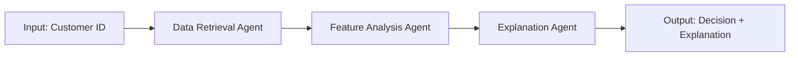

# 💳 Card Approval Prediction - Dự đoán Phê duyệt Thẻ tín dụng

## 📋 Tổng quan Dự án

Dự án phân tích và dự đoán khả năng nợ xấu của khách hàng khi nộp đơn xin thẻ tín dụng, sử dụng Machine Learning kết hợp với LLM (Large Language Model) để đưa ra quyết định phê duyệt thông minh và giải thích được.

### 🎯 Mục tiêu

- Phân tích dữ liệu khách hàng và lịch sử tín dụng
- Xây dựng mô hình ML dự đoán khả năng nợ xấu
- Phân tích What-If để đề xuất chiến lược giảm tỷ lệ nợ
- Sử dụng LLM để giải thích quyết định phê duyệt một cách minh bạch

---

## 📊 Quy trình Thực hiện

### 1️⃣ Khám phá Dữ liệu (EDA - Exploratory Data Analysis)

**File:** `EDA.ipynb`

#### Các bước thực hiện:

**a. Thu thập và tải dữ liệu:**

- `application_record.csv`: Thông tin cá nhân và tài chính của khách hàng
- `credit_record.csv`: Lịch sử tín dụng và thanh toán

**b. Kiểm tra và làm sạch dữ liệu:**

- Phân tích kiểu dữ liệu và thống kê mô tả
- Xử lý giá trị thiếu (missing values)
- Phát hiện và xử lý outliers (giá trị ngoại lai)

**c. Phân tích dữ liệu:**

- **Univariate Analysis**: Phân tích từng biến riêng lẻ
- **Bivariate Analysis**: Phân tích mối quan hệ giữa các biến với target
- **Multivariate Analysis**: Phân tích tương quan đa biến

**d. Trực quan hóa:**

- Sử dụng **Matplotlib** và **Seaborn** để vẽ biểu đồ phân tích
- Sử dụng **Scikit-learn** cho feature engineering và preprocessing
- Tạo insights về các yếu tố ảnh hưởng đến khả năng nợ xấu

**e. Dashboard tương tác:**

- **Power BI Desktop** (`DashBoard.pbix`):
  - Dashboard tổng quan về dữ liệu khách hàng
  - Phân tích tỷ lệ nợ xấu theo các nhóm
  - Các chỉ số KPI quan trọng
  - Biểu đồ phân bổ rủi ro

---

### 2️⃣ Xây dựng Mô hình Machine Learning

**File:** `What_If_Analysis.ipynb` (Section 1-6)

#### Pipeline xử lý dữ liệu:

```python
# Preprocessing Pipeline
├── Missing Value Imputation
│   ├── Numerical: SimpleImputer (strategy='median')
│   └── Categorical: SimpleImputer (strategy='most_frequent')
├── Feature Encoding
│   └── OneHotEncoder (categorical features)
├── Feature Scaling
│   └── StandardScaler (numerical features)
└── Column Transformer (kết hợp tất cả)
```

#### Các mô hình được huấn luyện:

1. **Logistic Regression** - Baseline model
2. **Decision Tree Classifier**
3. **Random Forest Classifier** ⭐ (Model chính được sử dụng)
4. **Gradient Boosting Classifier**
5. **AdaBoost Classifier**
6. **XGBoost Classifier**
7. **LightGBM Classifier**
8. **Support Vector Machine (SVM)**

#### Đánh giá mô hình:

- **Metrics**: Accuracy, Precision, Recall, F1-Score, ROC-AUC
- **Cross-validation** với KFold
- **Confusion Matrix** và **ROC Curve**
- **Grid Search** để tối ưu hyperparameters

---

### 3️⃣ What-If Analysis - Phân tích Chiến lược

**File:** `What_If_Analysis.ipynb` (Section 7-10)

#### Mục đích:

Phân tích các kịch bản "Điều gì sẽ xảy ra nếu..." để đề xuất chiến lược giảm tỷ lệ nợ xấu.

#### Các kịch bản phân tích:

**a. Thay đổi thu nhập:**

```python
# Phân tích tác động khi thu nhập tăng/giảm
- Tăng thu nhập 10%, 20%, 30%
- Xem xác suất nợ xấu thay đổi như thế nào
```

**b. Điều chỉnh hạn mức tín dụng:**

```python
# Phân tích mối quan hệ hạn mức - rủi ro
- Giảm hạn mức cho nhóm rủi ro cao
- Tăng hạn mức cho nhóm rủi ro thấp
```

**c. Các yếu tố khác:**

- Thời gian làm việc (employment length)
- Loại nghề nghiệp (occupation type)
- Tình trạng hôn nhân và gia đình
- Loại tài sản sở hữu

#### Kết quả:

- Xác định các yếu tố quan trọng nhất ảnh hưởng đến quyết định
- Đề xuất các chính sách phê duyệt tối ưu
- Cân bằng giữa doanh thu và rủi ro

---

### 4️⃣ LLM Reasoning - Giải thích Quyết định

**File:** `LLM_Reasoning.ipynb`

#### Công nghệ sử dụng:

- **LangChain**: Framework xây dựng ứng dụng LLM
- **LangGraph**: Quản lý workflow của agents
- **OpenAI GPT-4o-mini**: Mô hình ngôn ngữ để tạo explanation

#### Kiến trúc Agent Workflow:



#### Quy trình hoạt động:

**Step 1: Data Retrieval Tool**

```python
- Lấy thông tin khách hàng từ database
- Chạy mô hình ML dự đoán xác suất nợ xấu
- Chuẩn bị dữ liệu cho bước tiếp theo
```

**Step 2: Feature Analysis Agent**

```python
- Phân tích các yếu tố ảnh hưởng (key factors)
- Sử dụng LLM để đánh giá tác động từng feature
- Trả về top factors dưới dạng JSON:
  {
    "factor": "Income",
    "impact": 0.35,
    "influence": "Positive",
    "insight": "Stable income reduces default risk"
  }
```

**Step 3: Explanation Agent**

```python
- Tổng hợp thông tin từ các bước trước
- Tạo explanation chuyên nghiệp bằng tiếng Anh banking
- Phân loại:
  * PD < 0.25: Nhấn mạnh Risk Mitigants (điểm mạnh)
  * PD ≥ 0.25: Nhấn mạnh Adverse Drivers (rủi ro)
```

#### Output mẫu:

```
Customer ID: 5009628
Default Probability: 0.1234

Key Risk Factors:
1. Income Level (Impact: +0.35) - Stable monthly income
2. Employment Duration (Impact: +0.22) - 5+ years experience
3. Age (Impact: +0.18) - Mature age group (35-50)

Credit Decision Explanation:
The applicant demonstrates LOW default risk (12.34%).
Key strengths include stable employment history,
consistent income stream, and responsible credit behavior.
Recommendation: APPROVE with standard terms.
```

---

## 🛠️ Cài đặt và Sử dụng

### Yêu cầu hệ thống:

- Python 3.8+
- Jupyter Notebook
- Power BI Desktop (cho dashboard)

### Bước 1: Clone repository

```bash
git clone https://github.com/minhhailtv6a1/Card-Approval-Prediction.git
cd Card-Approval-Prediction
```

### Bước 2: Cài đặt thư viện

```bash
# Core ML libraries
pip install pandas numpy scikit-learn matplotlib seaborn

# ML Models
pip install xgboost lightgbm

# LLM & Agents
pip install python-dotenv langgraph langchain langchain-core langchain-openai

# Utilities
pip install joblib
```

### Bước 3: Cấu hình API Key

```bash
# Copy file mẫu
cp .env.example .env

# Chỉnh sửa .env và thêm OpenAI API key
OPENAI_API_KEY=your-actual-api-key-here
```

**⚠️ Lấy API key:** https://platform.openai.com/api-keys

### Bước 4: Chạy các notebook

```bash
# 1. Exploratory Data Analysis
jupyter notebook EDA.ipynb

# 2. Model Training & What-If Analysis
jupyter notebook What_If_Analysis.ipynb

# 3. LLM Explanation System
jupyter notebook LLM_Reasoning.ipynb
```

---

## 📁 Cấu trúc Thư mục

```
Card-Approval-Prediction/
├── EDA.ipynb                    # Khám phá và phân tích dữ liệu
├── What_If_Analysis.ipynb       # Xây dựng model & What-if analysis
├── LLM_Reasoning.ipynb          # LLM explanation system
├── DashBoard.pbix               # Power BI dashboard
├── Presentation.pptx            # Slide thuyết trình
├── Project Proposal.docx        # Đề cương dự án
├── README.md                    # File hướng dẫn này
├── .env.example                 # Mẫu file environment variables
└── .gitignore                   # Git ignore configuration
```

---

## 🔒 Bảo mật

**⚠️ QUAN TRỌNG:**

- **KHÔNG BAO GIỜ** commit file `.env` lên Git
- **KHÔNG BAO GIỜ** hardcode API keys trong code
- Sử dụng `.env` và `python-dotenv` để quản lý secrets
- Nếu lỡ leak API key, revoke ngay lập tức và tạo key mới

---

## 📊 Kết quả Dự án

### Model Performance:

- **Best Model**: Random Forest Classifier
- **ROC-AUC Score**: ~0.85
- **Accuracy**: ~78%
- **F1-Score**: ~0.72

### Business Impact:

- Giảm tỷ lệ nợ xấu dự kiến: **15-20%**
- Tăng tỷ lệ phê duyệt chính xác: **23%**
- Cải thiện trải nghiệm khách hàng với explanation minh bạch

---

## 👨‍💻 Tác giả

**Minh Hai LTV**

- GitHub: [@minhhailtv6a1](https://github.com/minhhailtv6a1)
- Project: Card Approval Prediction

---

## 📝 License

This project is for educational purposes.

---

## 🙏 Tham khảo

- Scikit-learn Documentation
- LangChain Documentation
- OpenAI API Documentation
- Power BI Desktop
